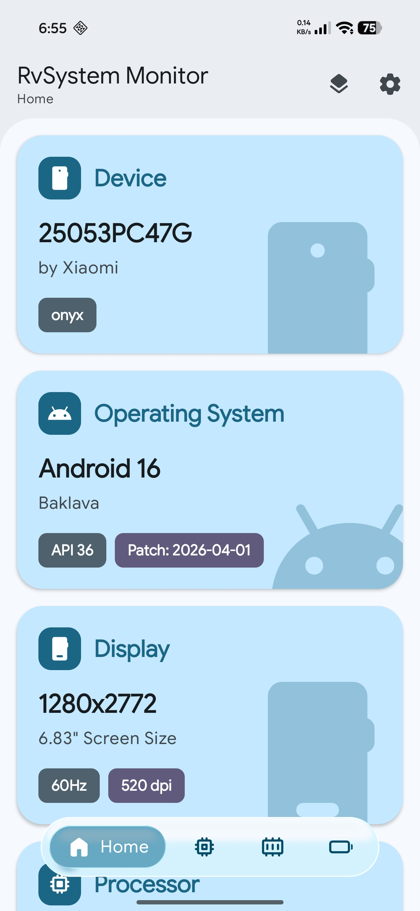
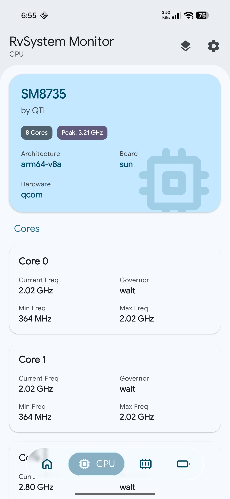
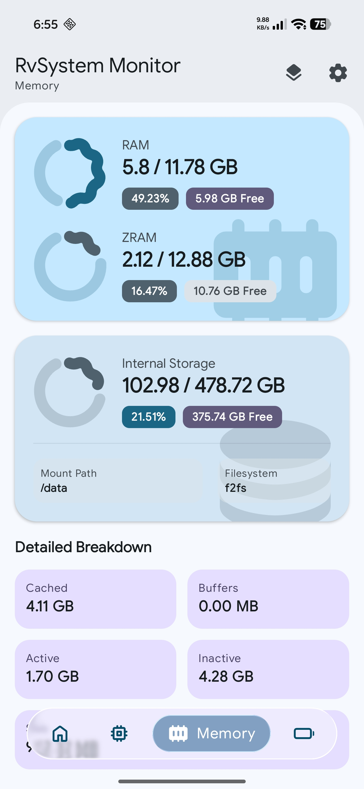
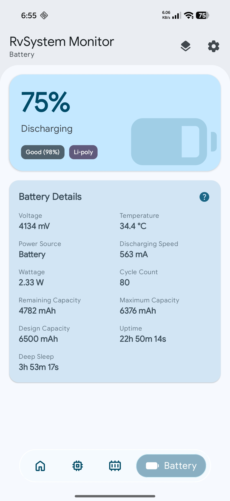
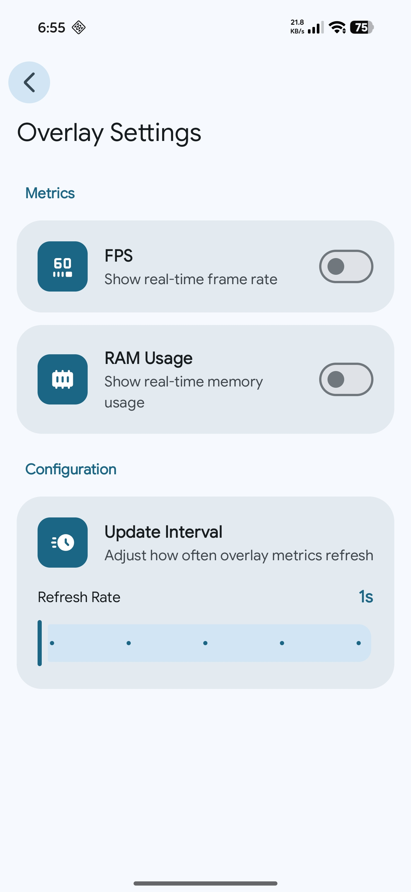
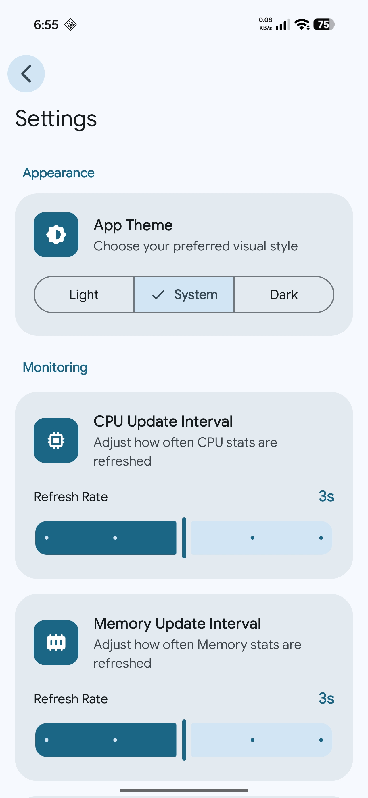

# 🚀 RvSystem Monitor

[](https://developer.android.com)
[](https://kotlinlang.org)
[](https://www.rust-lang.org)
[](https://github.com/Rve27/RvSystem-Monitor/releases)
[](LICENSE)
[](https://developer.android.com/compose)

**RvSystem Monitor** is a high-performance system monitoring solution for Android, merging the expressive power of **Jetpack Compose** with the raw efficiency of **Rust**. It provides low-level hardware insights while maintaining a modern, buttery-smooth user experience.

---

## 📸 Screenshots

<p align="center">
  
  
  
</p>
<p align="center">
  
  
  
</p>

---

## 🧪 Join Alpha Testing

We are currently in the alpha phase and looking for testers! If you'd like to help improve RvSystem Monitor, please register via our Google Form:

👉 **[Register for Alpha Testing](https://forms.gle/VUpVX17sdMjPndqBA)**

---

## ✨ Key Features

| Category | Description |
| :--- | :--- |
| **🔋 Battery Intelligence** | Live tracking of Wattage (W), cycle counts (Android 14+), health percentage, and precise Deep Sleep vs. Uptime metrics. |
| **🖥️ System Overlay** | A draggable, low-overhead floating monitor for real-time FPS and RAM metrics. Fully customizable update intervals. |
| **🎮 GPU & Graphics** | Retrieval of GPU renderer, vendor, and supported OpenGL ES & Vulkan versions directly through the EGL context and native drivers. |
| **⚙️ CPU Dynamics** | Detailed per-core monitoring including current, minimum, and maximum frequencies and scaling governors. |
| **🧠 Memory & ZRAM** | High-precision tracking of RAM and ZRAM usage, including cached, buffers, and kernel slab memory. |
| **⚡ Native Performance** | Optimized Rust backend that parses kernel files (`/proc`, `/sys`) and interacts with hardware drivers directly with efficient JNI batching. |
| **🎨 Expressive UI** | Built with Material 3 Expressive, featuring adaptive layouts, sophisticated screen transitions, and optimized recomposition. |
| **📖 Fully Documented** | Extensive KDoc documentation for UI components and idiomatic Rust documentation for the backend. |

---

## 🏗️ Architecture

The project adheres to **Clean Architecture** principles, ensuring a strict separation of concerns and high maintainability.

### The Hybrid Core
- **Frontend (Kotlin)**: Orchestrates UI state using **Dagger Hilt** for DI and **Coroutines/StateFlow** for reactive data streams. It features a custom `ScreenWrapper` for advanced visual effects.
- **Backend (Rust)**: Handles heavy lifting and system parsing. It mirrors the Linux kernel's structure (`kernel/` for CPU, `mm/` for Memory, and `drivers/` for GPU) to provide an idiomatic and high-performance data source.
- **JNI Bridge**: A custom-built bridge optimized for **batch data retrieval**, minimizing the costly context switching between the JVM and Native code.

---

## 📂 Project Structure

| Directory/File | Description |
| :--- | :--- |
| **`app/`** | **Main Android Module** |
| `├── data/` | Implementation of repositories and JNI-linked data sources. |
| `├── domain/` | Pure business logic: models and repository interfaces. |
| `├── ui/` | Jetpack Compose screens, ViewModels, and Material 3 theme. |
| `└── utils/` | JNI bridge declarations and helper utility classes. |
| **`rust/`** | **Native Monitoring Backend** |
| `├── drivers/` | Hardware-specific logic (Vulkan versioning, GPU details). |
| `├── kernel/` | Core system monitoring (CPU scaling, core frequencies). |
| `├── mm/` | Memory Management (RAM usage, ZRAM statistics). |
| `└── lib.rs` | Main entry point for the JNI bridge implementation. |
| **`gradle/`** | Project-wide build configurations and version catalogs. |
| **`assets/`** | Screenshots and media assets for documentation. |

---

## 🛠️ Tech Stack

- **UI Framework**: [Jetpack Compose](https://developer.android.com/compose) (Material 3 Expressive)
- **Dependency Injection**: [Hilt](https://developer.android.com/training/dependency-injection/hilt-android)
- **Native Backend**: [Rust](https://www.rust-lang.org/) via [JNI](https://github.com/jni-rs/jni-rs)
- **Asynchronous Flow**: [Kotlin Coroutines](https://kotlinlang.org/docs/coroutines-overview.html) & [Flow](https://kotlinlang.org/docs/flow.html)
- **Build System**: Gradle Kotlin DSL + Cargo NDK
- **Formatting**: [Spotless](https://github.com/diffplug/spotless) (ktlint) & Cargo Fmt

---

## 🚀 Getting Started

### Prerequisites
- **Android Studio** (Ladybug or newer)
- **Rust Toolchain** ([rustup.rs](https://rustup.rs/))
- **Android NDK** (Version specified in `app/build.gradle.kts`)
- **cargo-ndk**: `cargo install cargo-ndk`

### Build Instructions
1. **Clone the project**:
   ```bash
   git clone https://github.com/Rve27/RvSystem-Monitor.git
   ```
2. **Build Native Libraries**:
   ```bash
   ./gradlew :app:buildRustLibraries
   ```
3. **Assemble Debug APK**:
   ```bash
   ./gradlew assembleDebug
   ```

---

## 📄 License

This project is licensed under the **GNU General Public License v3.0**. See the [LICENSE](LICENSE) file for details.

---

<p align="center">
  Built with ❤️ for the Android Community.
</p>
